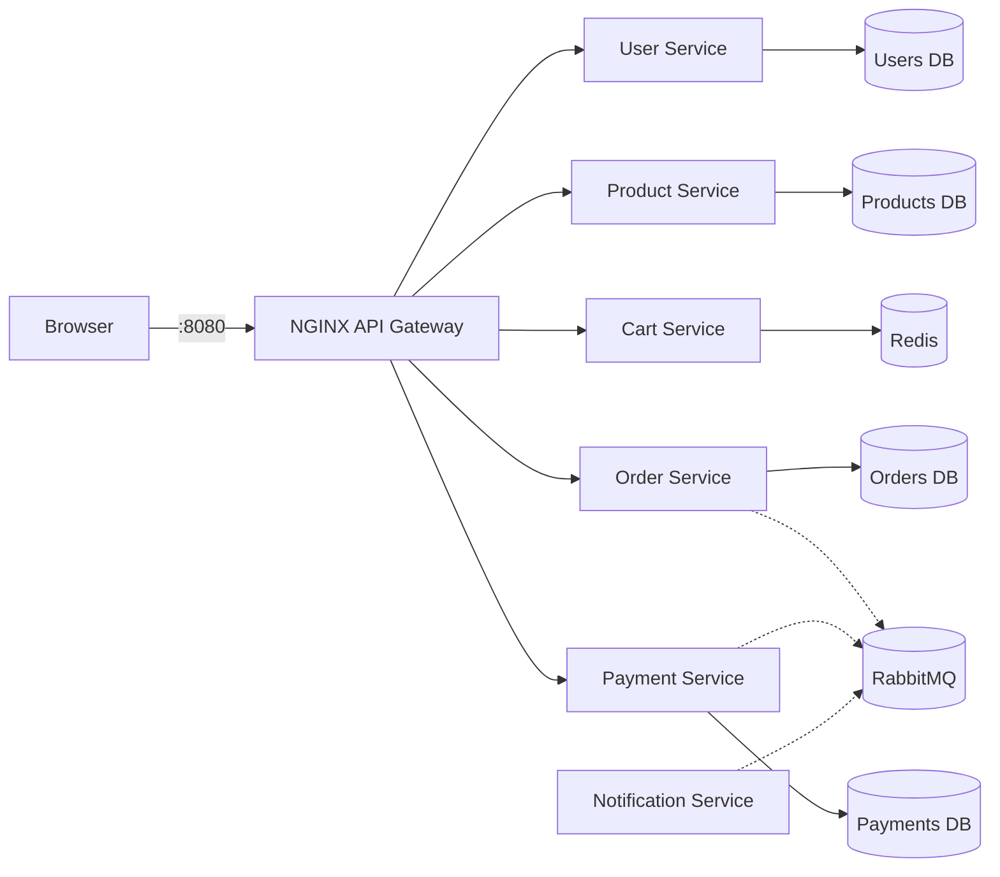

# ScaleCart

A production-style e-commerce platform built as a monorepo of independently deployable FastAPI services behind an NGINX gateway, with a React storefront. The repository is being delivered progressively; **Phase 3 (product catalog) is implemented**.

## What works now

- React 18, strict TypeScript, Vite, Tailwind CSS, and shadcn-compatible UI primitives
- NGINX serving the single-page application and routing `/api/*` traffic
- Six FastAPI service shells with `/health`, `/ready`, `/metrics`, OpenAPI, structured JSON logs, request IDs, CORS, and consistent errors
- User registration and login with Argon2 password hashing and signed, short-lived JWT access tokens
- One-time refresh-token rotation and revocation, backed by hashed token records in PostgreSQL
- Authenticated customer profiles, customer/admin roles, admin-only role assignment, and owned address CRUD
- Category and product discovery with search, price/stock filters, sorting, and pagination
- Product variants with SKU, minor-unit pricing, attributes and stock, plus ordered product media
- Responsive storefront collection, category, and product-detail experiences
- One PostgreSQL cluster with isolated databases owned by user, product, order, and payment services
- Redis for the future cart service and RabbitMQ for future domain events
- Prometheus scraping every API and Grafana with an auto-provisioned datasource
- Ruff, ESLint, Pytest, HTTPX, Vitest, and React Testing Library setup
- Reproducible containers, health checks, a non-root application user, and GitHub Actions CI

## Architecture



PostgreSQL runs as one local container for economy, but each owning service receives credentials for a distinct database and never reads another service's data. Production can move these databases to separate clusters without changing a service contract.

## Run locally

Requirements: Docker with Compose v2+. No local Python or Node installation is needed to run the application.

```bash
cp .env.example .env
docker compose up --build -d
make migrate
```

Run `make seed` after migrating to load the sample catalog. To also create or promote the first
administrator, set `BOOTSTRAP_ADMIN_EMAIL` and `BOOTSTRAP_ADMIN_PASSWORD` in `.env` first. Seeding is
idempotent and does not reset an existing account's password.

Open:

- Storefront and API gateway: <http://localhost:8080>
- End-to-end readiness: <http://localhost:8080/api/system/ready>
- RabbitMQ management: <http://localhost:15672>
- Prometheus: <http://localhost:9090>
- Grafana: <http://localhost:3000>

The credentials in `.env.example` are public development defaults. Change them in `.env`; `.env` is ignored by Git. Internal service ports are not published to the host.

## Commands

```bash
make up                 # build and start the stack
make down               # stop it without deleting data
make logs               # follow container logs
make ps                 # show service health
make install-backend    # create .venv and install backend dev dependencies
make install-frontend   # install locked frontend dependencies
make lint
make test
make migrate
make seed               # load sample products and optionally bootstrap an admin
npm run test:e2e --prefix apps/storefront  # with the Compose stack running
```

## API gateway routes

| Public prefix | Owning service |
|---|---|
| `/api/auth`, `/api/users` | user-service |
| `/api/products`, `/api/categories` | product-service |
| `/api/cart` | cart-service |
| `/api/orders` | order-service |
| `/api/payments` | payment-service |

Each service exposes operational endpoints internally: `GET /health`, `GET /ready`, and `GET /metrics`. The gateway's temporary `/api/system/ready` route demonstrates the Phase 1 browser-to-database path.

The Phase 2 user API provides:

| Method and path | Purpose |
|---|---|
| `POST /api/auth/register` | Create a customer and return an access/refresh token pair |
| `POST /api/auth/login` | Authenticate with email and password |
| `POST /api/auth/refresh` | Rotate a refresh token; the submitted token becomes unusable |
| `POST /api/auth/logout` | Revoke a refresh token |
| `GET`, `PATCH /api/users/me` | Read or update the authenticated profile |
| `GET`, `POST /api/users/me/addresses` | List or create owned addresses |
| `PATCH`, `DELETE /api/users/me/addresses/{id}` | Update or remove an owned address |
| `GET /api/users/{id}` | Read a user as an administrator |
| `PUT /api/users/{id}/roles` | Replace a user's roles as an administrator |

See [the user-service contract](docs/architecture/user-service.md) for request examples and security
behavior.

The Phase 3 catalog API provides:

| Method and path | Purpose |
|---|---|
| `GET /api/categories` | List active categories |
| `GET /api/categories/{slug}` | Read an active category |
| `GET /api/products` | Search, filter, sort, and paginate active products |
| `GET /api/products/{slug}` | Read a product with its active variants and ordered images |
| `POST`, `PATCH`, `DELETE /api/categories...` | Administer categories |
| `POST`, `PATCH`, `DELETE /api/products...` | Administer products, variants, stock, and images |

Catalog write routes require an access token with the `admin` role. See
[the product-service contract](docs/architecture/product-service.md) for query parameters, money
representation, and write behavior.

## Environment variables

| Name | Purpose |
|---|---|
| `POSTGRES_USER`, `POSTGRES_PASSWORD` | Local PostgreSQL login |
| `JWT_SECRET_KEY`, `JWT_ISSUER`, `JWT_AUDIENCE` | JWT signing and claim validation |
| `ACCESS_TOKEN_MINUTES`, `REFRESH_TOKEN_DAYS` | Authentication token lifetimes |
| `BOOTSTRAP_ADMIN_*` | Optional first-administrator seed values |
| `REDIS_URL` | Cart store connection URL |
| `RABBITMQ_DEFAULT_USER`, `RABBITMQ_DEFAULT_PASS` | Broker bootstrap login |
| `RABBITMQ_URL` | AMQP service connection URL |
| `CORS_ORIGINS` | Comma-separated browser origins |
| `LOG_LEVEL` | Service logging threshold |
| `VITE_API_BASE_URL` | Build-time gateway path used by React |
| `GRAFANA_ADMIN_PASSWORD` | Local Grafana administrator password |

See [the system overview](docs/architecture/system-overview.md) for boundaries and design constraints.

## Delivery roadmap

Phases 1–3 provide the platform foundation, user domain, and browsable product catalog. Cart, orders, checkout, payments, events, resilience, and Kubernetes follow in their requested phases.
