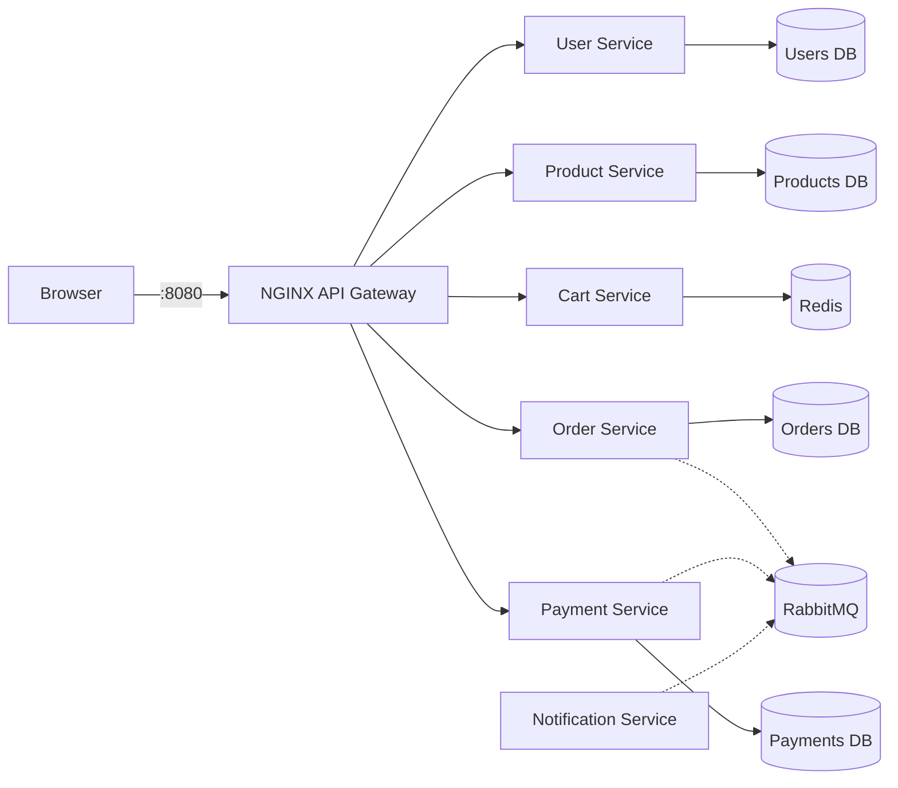

# ScaleCart

A production-style e-commerce platform built as a monorepo of independently deployable FastAPI services behind an NGINX gateway, with a React storefront. The repository is being delivered progressively; **Phase 1 (foundation) is implemented** and domain features intentionally begin in Phase 2.

## What works now

- React 18, strict TypeScript, Vite, Tailwind CSS, and shadcn-compatible UI primitives
- NGINX serving the single-page application and routing `/api/*` traffic
- Six FastAPI service shells with `/health`, `/ready`, `/metrics`, OpenAPI, structured JSON logs, request IDs, CORS, and consistent errors
- One PostgreSQL cluster with isolated databases owned by user, product, order, and payment services
- Redis for the future cart service and RabbitMQ for future domain events
- Prometheus scraping every API and Grafana with an auto-provisioned datasource
- Ruff, ESLint, Pytest, HTTPX, Vitest, and React Testing Library setup
- Reproducible containers, health checks, a non-root application user, and GitHub Actions CI

## Architecture



PostgreSQL runs as one local container for economy, but each owning service receives credentials for a distinct database and never reads another service's data. Production can move these databases to separate clusters without changing a service contract.

## Run locally

Requirements: Docker with Compose v2+. No local Python or Node installation is needed to run the application.

```bash
cp .env.example .env
docker compose up --build
```

Open:

- Storefront and API gateway: <http://localhost:8080>
- End-to-end readiness: <http://localhost:8080/api/system/ready>
- RabbitMQ management: <http://localhost:15672>
- Prometheus: <http://localhost:9090>
- Grafana: <http://localhost:3000>

The credentials in `.env.example` are public development defaults. Change them in `.env`; `.env` is ignored by Git. Internal service ports are not published to the host.

## Commands

```bash
make up                 # build and start the stack
make down               # stop it without deleting data
make logs               # follow container logs
make ps                 # show service health
make install-backend    # create .venv and install backend dev dependencies
make install-frontend   # install locked frontend dependencies
make lint
make test
make migrate
make seed               # becomes active when domain models are introduced
npm run test:e2e --prefix apps/storefront  # with the Compose stack running
```

## API gateway routes

| Public prefix | Owning service |
|---|---|
| `/api/auth`, `/api/users` | user-service |
| `/api/products`, `/api/categories` | product-service |
| `/api/cart` | cart-service |
| `/api/orders` | order-service |
| `/api/payments` | payment-service |

Each service exposes operational endpoints internally: `GET /health`, `GET /ready`, and `GET /metrics`. The gateway's temporary `/api/system/ready` route demonstrates the Phase 1 browser-to-database path.

## Environment variables

| Name | Purpose |
|---|---|
| `POSTGRES_USER`, `POSTGRES_PASSWORD` | Local PostgreSQL login |
| `REDIS_URL` | Cart store connection URL |
| `RABBITMQ_DEFAULT_USER`, `RABBITMQ_DEFAULT_PASS` | Broker bootstrap login |
| `RABBITMQ_URL` | AMQP service connection URL |
| `CORS_ORIGINS` | Comma-separated browser origins |
| `LOG_LEVEL` | Service logging threshold |
| `VITE_API_BASE_URL` | Build-time gateway path used by React |
| `GRAFANA_ADMIN_PASSWORD` | Local Grafana administrator password |

See [the system overview](docs/architecture/system-overview.md) for boundaries and design constraints.

## Delivery roadmap

Phase 2 adds user registration, JWT authentication, refresh-token rotation, profiles, roles, addresses, database models, and migrations. Catalog, cart, orders, checkout, payments, events, resilience, and Kubernetes follow in their requested phases rather than being prematurely coupled to the foundation.
