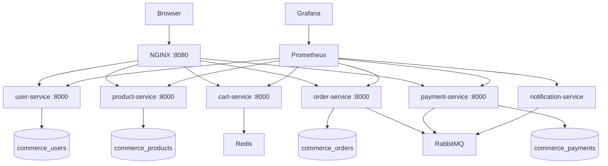

# System overview

## Current topology

The browser has one origin and one API authority: NGINX on port 8080. NGINX serves the compiled React application, attaches or forwards a request ID, adds security headers, and routes API paths to services on the private Compose network.

## Ownership rules

- A service owns its schema and migrations. Another service may use its REST contract or consume an event; it may not connect to that database.
- `python-common` contains only cross-cutting transport and operational concerns. It cannot contain domain models or business rules.
- Redis and RabbitMQ are provisioned now, but domain use begins in later phases.
- All browser API traffic flows through the gateway. Backend container ports remain private.

## Operational contract

Every service provides:

- `/health`: process liveness only
- `/ready`: verifies that required infrastructure is reachable
- `/metrics`: Prometheus exposition format
- `X-Request-ID`: accepts the gateway ID or creates one, includes it in logs and responses
- JSON errors shaped as `{ "error": { "code", "message", "correlation_id", "details?" } }`

## Phase 2 user domain

The user service owns `users`, `roles`, `user_roles`, `addresses`, and `refresh_tokens`. Passwords are
stored only as Argon2 hashes. Access JWTs are short-lived and stateless, while refresh JWTs are stored
as SHA-256 hashes and rotated under a row lock. Profile and address routes always derive ownership from
the access token; clients cannot submit a user ID for these operations. Administrative user lookup and
role replacement require a current database-backed `admin` role.

No other service reads the user database. Later services receive user identity through authenticated
API claims or explicit service contracts rather than shared tables.
