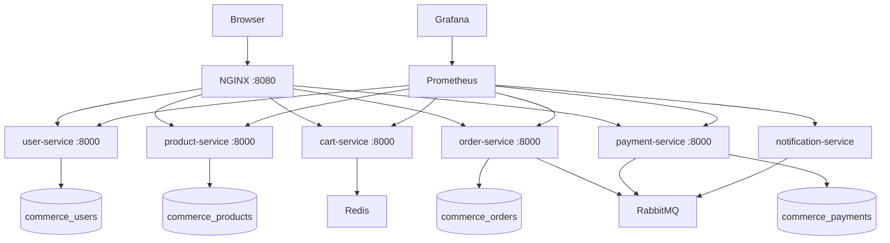

# System overview

## Current topology

The browser has one origin and one API authority: NGINX on port 8080. NGINX serves the compiled React application, attaches or forwards a request ID, adds security headers, and routes API paths to services on the private Compose network.

## Ownership rules

- A service owns its schema and migrations. Another service may use its REST contract or consume an event; it may not connect to that database.
- `python-common` contains only cross-cutting transport and operational concerns. It cannot contain domain models or business rules.
- Redis and RabbitMQ are provisioned now, but domain use begins in later phases.
- All browser API traffic flows through the gateway. Backend container ports remain private.

## Operational contract

Every service provides:

- `/health`: process liveness only
- `/ready`: verifies that required infrastructure is reachable
- `/metrics`: Prometheus exposition format
- `X-Request-ID`: accepts the gateway ID or creates one, includes it in logs and responses
- JSON errors shaped as `{ "error": { "code", "message", "correlation_id", "details?" } }`

## Phase 2 user domain

The user service owns `users`, `roles`, `user_roles`, `addresses`, and `refresh_tokens`. Passwords are
stored only as Argon2 hashes. Access JWTs are short-lived and stateless, while refresh JWTs are stored
as SHA-256 hashes and rotated under a row lock. Profile and address routes always derive ownership from
the access token; clients cannot submit a user ID for these operations. Administrative user lookup and
role replacement require a current database-backed `admin` role.

No other service reads the user database. Later services receive user identity through authenticated
API claims or explicit service contracts rather than shared tables.

## Phase 3 catalog domain

The product service owns `categories`, `products`, `product_variants`, and `product_images`. Products
are soft-archived so existing references remain meaningful, while public reads expose only active
categories, products, and variants. Prices use integer minor units and an explicit ISO currency code,
avoiding floating-point calculations at service boundaries.

Public catalog reads need no authentication. Catalog writes validate the signed access token issued by
the user service and require its short-lived `admin` role claim; the product service never connects to
the user database. Role changes therefore propagate to catalog authorization when the current access
token expires or is replaced.

## Phase 4 cart domain

The cart service owns ephemeral cart state in Redis. Guest carts use opaque UUIDs supplied through
`X-Cart-ID`; authenticated carts use the validated access-token subject. A guest cart can be merged
once into the customer cart after authentication. Keys have a sliding 30-day expiry, and mutations use
Redis optimistic transactions so concurrent requests do not silently overwrite each other.

Cart items store a display snapshot, not product authority. Every read and mutation resolves variants
through product-service's private-network contract to reconcile current price, availability, and stock.
The cart service does not connect to the product database, and unavailable lines are excluded from the
payable subtotal.

## Phase 6 order domain

Order-service orchestrates checkout without reading another service's database. It retrieves the live
cart contract, persists immutable item and delivery snapshots, and asks product-service for an
idempotent inventory reservation. Successful orders enter `pending_payment`, with a configurable
reservation deadline; payment authorization follows in Phase 7.

Guest orders use a private tracking token while JWT-authenticated customers can list their history.
Checkout idempotency keys prevent duplicate orders, inventory reservations prevent overselling, and
administrator status changes follow an explicit transition graph. Cancelling before fulfillment
idempotently returns reserved inventory. Every transition records its prior and next state, actor,
reason, and timestamp. An administrator or scheduled operation can safely release expired reservations;
failed dependency calls leave the order eligible for a later retry.
